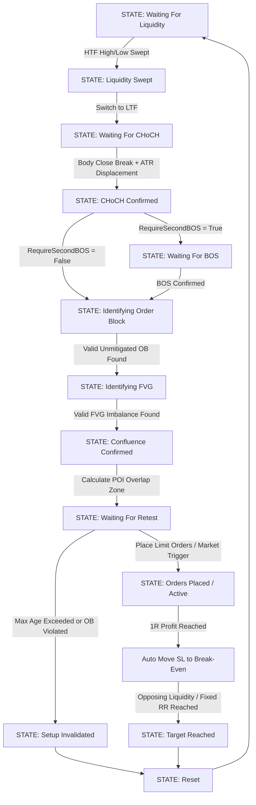

# Institutional SMC Liquidity EA — MetaTrader 5 (MT5)

[](https://www.metatrader5.com/)
[](https://www.mql5.com/)
[](#strategy-architecture)
[](LICENSE)
[](#installation)

An enterprise-grade, deterministic **Smart Money Concepts (SMC) & Institutional Liquidity Expert Advisor** for **MetaTrader 5**. Engineered for precision execution, structural confluence verification, automated risk modeling, and multi-symbol processing.

---

## 📑 Table of Contents

- [Executive Summary](#-executive-summary)
- [Strategy Architecture & Core Lifecycle](#-strategy-architecture--core-lifecycle)
  - [1. Higher-Timeframe Liquidity Mapping](#1-higher-timeframe-htf-liquidity-mapping)
  - [2. Institutional Liquidity Sweep Detection](#2-institutional-liquidity-sweep-detection)
  - [3. Lower-Timeframe Market Structure Shift (CHoCH)](#3-lower-timeframe-ltf-market-structure-shift-choch)
  - [4. Break of Structure (BOS) Confirmation](#4-break-of-structure-bos-confirmation)
  - [5. Order Block (OB) Identification](#5-order-block-ob-identification)
  - [6. Fair Value Gap (FVG) Imbalance Detection](#6-fair-value-gap-fvg-imbalance-detection)
  - [7. Confluence Zone (POI) & Entry Engineering](#7-confluence-zone-poi--entry-engineering)
- [Order Execution & Position Management](#-order-execution--position-management)
- [Institutional Risk & Protection Armor](#-institutional-risk--protection-armor)
- [Real-Time HUD Dashboard & Visual Engine](#-real-time-hud-dashboard--visual-engine)
- [Input Parameters Reference](#-input-parameters-reference)
- [Backtesting & Optimization Guide](#-backtesting--optimization-guide)
- [Installation & Quick Start](#-installation--quick-start)
- [Multi-Symbol Configuration](#-multi-symbol-configuration)
- [Architecture & State Machine](#-architecture--state-machine)
- [Disclaimer](#-disclaimer)

---

## ⚡ Executive Summary

Discretionary Smart Money trading often suffers from subjective bias, emotional hesitation, and late entries. The **SMC Liquidity EA** transforms institutional price delivery logic into a **100% mathematical, deterministic finite state machine**.

Every setup requires sequential confirmation across multiple dimensions:
1. **HTF Liquidity Sweep** (Buy-Side / Sell-Side Liquidity raid).
2. **Displacement & Structure Shift** (CHoCH with ATR-based candle body displacement filter).
3. **Institutional Imbalance Validation** (Order Block + Fair Value Gap overlap confluence).
4. **Discount/Premium POI Retest** with automated pending limits and dynamic position sizing.

```
HTF Liquidity Sweep ──► LTF CHoCH (Displacement) ──► OB + FVG Overlap Confluence ──► Precision Limit Entry ──► 1R Break-Even & Dynamic Target
```

---

## 🧠 Strategy Architecture & Core Lifecycle



### 1. Higher-Timeframe (HTF) Liquidity Mapping
- Scans `SwingLookback` bars on the Higher Timeframe (e.g., `H1` or `H4`).
- Utilizes symmetric fractal peak/valley detection (`HTFSwingStrength`) to map significant **Buy-Side Liquidity (BSL)** at swing highs and **Sell-Side Liquidity (SSL)** at swing lows.
- Merges clusters of equal highs/lows within `LiquidityTolPoints` into high-liquidity pools.

### 2. Institutional Liquidity Sweep Detection
- Continuously monitors live price action for penetration beyond established HTF liquidity levels.
- Supports 3 institutional sweep modes:
  - **`SWEEP_WICK_ONLY`**: Price penetrates level by `SweepBufferPoints` but candle closes inside the range.
  - **`SWEEP_CLOSE_BACK`**: Subsequent candle closes back across the liquidity line.
  - **`SWEEP_WICK_AND_CLOSE`** *(Recommended)*: Rapid penetration with immediate rejection candle close back within the structure.
- Assigns directional market bias:
  - **Buy-Side Swept** $\rightarrow$ **Bearish Setup**
  - **Sell-Side Swept** $\rightarrow$ **Bullish Setup**

### 3. Lower-Timeframe (LTF) Market Structure Shift (CHoCH)
- Transitions immediately to the execution timeframe (e.g., `M5` or `M15`).
- Identifies the most recent LTF structural swing point.
- Validates the Change of Character (CHoCH) using strict body close breaks (`BREAK_BODY_CLOSE`) beyond `MinBreakDistPoints`.
- **Institutional Displacement Filter**: Requires the breaking candle body to be $\ge \text{MinDisplacementATR} \times \text{ATR}(14)$ to weed out false breaks and low-volume consolidation.

### 4. Break of Structure (BOS) Confirmation
- Optional additional confirmation layer (`RequireSecondBOS`).
- Validates structural trend continuation in the direction of the new institutional bias after CHoCH.

### 5. Order Block (OB) Identification
- Locates the last opposing candle prior to the displacement impulse within `OBLookbackCandles`.
- Captures the true institutional footprint (full candle or body range via `OBUseBodyOnly`).
- Enforces freshness and validity constraints (`OBMinSizePoints`, `OBMaxAgeBars`).

### 6. Fair Value Gap (FVG) Imbalance Detection
- Detects standard 3-candle price imbalances where Candle 1 High < Candle 3 Low (Bullish) or Candle 1 Low > Candle 3 High (Bearish).
- Filters gaps within allowable boundaries (`MinFVGSizePoints` to `MaxFVGSizePoints`).
- Enforces mitigation thresholds (`FVGMitigationPct`).

### 7. Confluence Zone (POI) & Entry Engineering
- Intersects the Order Block and Fair Value Gap coordinates to define the **Point of Interest (POI)**.
- If overlap exceeds `MinOverlapPoints`, the zone is tagged as **High-Probability Confluence**.
- Automatically configures pending limit orders (`Buy Limit` / `Sell Limit`) across the POI.

---

## 🎯 Order Execution & Position Management

| Feature | Description | Default Setting |
| :--- | :--- | :--- |
| **Entry Modes** | Pending Limit Orders, Immediate Market on POI Touch, or Hybrid | `ENTRY_PENDING` |
| **Order Splitting** | Distribute total setup risk across 1 to 10 split limit orders inside the POI zone | `1 Entry` (Configurable) |
| **Volume Distribution** | `VOL_EQUAL` (equal split) or `VOL_WEIGHTED` (higher volume allocated deeper in POI) | `VOL_EQUAL` |
| **Stop Loss (SL)** | Dynamic structural placement beyond the Order Block outer boundary + `SLBufferPoints` | Automatic |
| **Take Profit (TP)** | Risk:Reward Multiple (`1:2`, `1:3`, etc.), Opposing Liquidity Target (`TP_LIQUIDITY`), or Hybrid | `TP_RISK_REWARD` (2.0R) |
| **Break-Even Automator** | Automatically shifts SL to entry price + 1 point the moment floating profit achieves 1.0R | `True` |
| **Partial Profit Taking** | Closes a configurable fraction (e.g. 50%) of volume at milestone targets | Optional |
| **Trailing Stop** | Dynamic trailing stop once price exceeds predetermined profit thresholds | Configurable (0 = Disabled) |

---

## 🛡️ Institutional Risk & Protection Armor

- **Precise Lot Normalization**: Automatically converts account risk percentage (`RiskPercentPerSetup`) into broker-normalized lot sizes according to exact instrument tick size, tick value, volume step, minimum lots, and maximum lots.
- **Daily Drawdown Cap**: Hard equity circuit breaker (`MaxDailyLossPct`). Pauses trading immediately if cumulative closed + floating daily loss reaches the threshold.
- **Max Daily Trade Limit**: Prevents overtrading in choppy market conditions (`MaxDailyTrades`).
- **Concurrent Exposure Cap**: Restricts simultaneous open trades across all symbols (`MaxOpenTrades`).
- **Free Margin Defense**: Blocks order creation if account free margin falls below `MinFreeMarginPct`.
- **Spread & Slippage Shield**: Rejects execution if live spread exceeds `MaxSpreadPoints` or broker slippage exceeds `Slippage`.
- **Session & News Timing Filters**: Configurable trading hours (London / New York sessions) and pre/post-news event blackouts.

---

## 🖥️ Real-Time HUD Dashboard & Visual Engine

The EA renders a real-time HUD dashboard and chart annotations directly on your MT5 chart:

```
╔═══════════════════════════════════════════════════╗
║               SMC LIQUIDITY EA                    ║
╠═══════════════════════════════════════════════════╣
║  State:       ORDERS_PLACED                       ║
║  Symbol:      EURUSD      │  Bias: BULLISH        ║
╟───────────────────────────────────────────────────╢
║  Liquidity:   ✓           │  CHoCH: ✓             ║
║  BOS:         ✓           │  OB:    ✓             ║
║  FVG:         ✓           │  Conf:  ✓             ║
╟───────────────────────────────────────────────────╢
║  POI Zone:    1.08420 - 1.08465                   ║
║  SL:          1.08380     │  TP:    1.08630       ║
╟───────────────────────────────────────────────────╢
║  Positions:   1           │  Pending: 0           ║
║  Daily P/L:   +$340.50                            ║
║  Trades:      2 / 5                               ║
║  Spread:      8 pts       │  Max: 30              ║
║  HTF:         H1          │  LTF: M5              ║
╚═══════════════════════════════════════════════════╝
```

### Chart Overlay Visualizations
- 🔵 **Dodger Blue Lines**: Higher-Timeframe Buy-Side Liquidity Pools (BSL).
- 🔴 **Orange-Red Lines**: Higher-Timeframe Sell-Side Liquidity Pools (SSL).
- 🟡 **Gold Arrow & Tag**: Verified Liquidity Sweep Events.
- 🟢 **Lime Dash-Dot Line**: Change of Character (CHoCH) structural breach.
- 💎 **Aqua Dash Line**: Break of Structure (BOS) trend continuation.
- 🟩 **Green/Crimson Boxes**: Bullish / Bearish Order Blocks (OB).
- 🔷 **Cyan/Orange Boxes**: Bullish / Bearish Fair Value Gaps (FVG).
- 🟪 **Magenta Shaded Zone**: Confirmed OB + FVG Overlap Confluence (POI).
- 🎯 **Green/Red Horizontal Lines**: Live TP and SL trajectories.

> **Note**: In MT5 Strategy Tester non-visual mode and Genetic Optimization runs, the visual engine automatically disengages to allow **maximum execution throughput**.

---

## ⚙️ Input Parameters Reference

### General Configuration
| Parameter | Type | Default | Description |
| :--- | :--- | :--- | :--- |
| `MagicNumber` | `long` | `202409` | Unique identifier for the EA's orders |
| `EAComment` | `string` | `"SMC_LIQ"` | Comment string attached to trade orders |

### Timeframes
| Parameter | Type | Default | Description |
| :--- | :--- | :--- | :--- |
| `HTF_Timeframe` | `ENUM_TIMEFRAMES` | `PERIOD_H1` | Higher Timeframe for Liquidity identification |
| `LTF_Timeframe` | `ENUM_TIMEFRAMES` | `PERIOD_M5` | Lower Timeframe for CHoCH, OB, FVG, & execution |

### Swing Detection
| Parameter | Type | Default | Description |
| :--- | :--- | :--- | :--- |
| `SwingLookback` | `int` | `100` | Number of HTF bars scanned for swing levels |
| `HTFSwingStrength` | `int` | `5` | Fractal bars on each side for HTF swing highs/lows |
| `LTFSwingStrength` | `int` | `3` | Fractal bars on each side for LTF swing points |
| `MinSwingDistPoints` | `int` | `100` | Minimum vertical distance between adjacent swings |
| `LiquidityTolPoints` | `int` | `15` | Tolerance for identifying equal highs/lows |

### Liquidity Sweep
| Parameter | Type | Default | Description |
| :--- | :--- | :--- | :--- |
| `SweepBufferPoints` | `int` | `5` | Buffer required beyond liquidity level |
| `MinSweepDistPoints` | `int` | `10` | Minimum penetration distance for valid sweep |
| `SweepConfirmationMode` | `ENUM_SWEEP_MODE` | `SWEEP_WICK_AND_CLOSE` | Sweep validation model (`WICK_ONLY`, `CLOSE_BACK`, `WICK_AND_CLOSE`) |

### Structure & Displacement (CHoCH)
| Parameter | Type | Default | Description |
| :--- | :--- | :--- | :--- |
| `StructureBreakMethod` | `ENUM_BREAK_METHOD` | `BREAK_BODY_CLOSE` | Break verification (`BREAK_WICK`, `BREAK_CANDLE_CLOSE`, `BREAK_BODY_CLOSE`) |
| `MinBreakDistPoints` | `int` | `5` | Minimum penetration past structural swing |
| `MinDisplacementATR` | `double` | `1.0` | Minimum displacement candle body size ($N \times \text{ATR}$) |
| `ATRPeriod` | `int` | `14` | Period for Average True Range volatility calculation |

### Order Block & Fair Value Gap
| Parameter | Type | Default | Description |
| :--- | :--- | :--- | :--- |
| `OBLookbackCandles` | `int` | `10` | Bars inspected before displacement for OB origin |
| `OBUseBodyOnly` | `bool` | `false` | Use candle body only vs full candle high/low range |
| `OBMinSizePoints` | `int` | `5` | Minimum height required for valid Order Block |
| `OBMaxAgeBars` | `int` | `200` | Maximum LTF bars before an OB expires |
| `MinFVGSizePoints` | `int` | `5` | Minimum gap height for valid Fair Value Gap |
| `MaxFVGSizePoints` | `int` | `500` | Maximum gap height (filters freak volatility) |
| `FVGMitigationPct` | `double` | `50.0` | Invalidation threshold when price enters FVG |
| `RequireOBFVGConfluence`| `bool` | `true` | Require spatial overlap between OB and FVG |
| `MinOverlapPoints` | `int` | `3` | Minimum overlap height in points |
| `AllowFVGOnlyEntry` | `bool` | `true` | Allow trade on clean FVG if OB has no overlap |

### Trade Management & Risk
| Parameter | Type | Default | Description |
| :--- | :--- | :--- | :--- |
| `EntryMode` | `ENUM_ENTRY_MODE` | `ENTRY_PENDING` | `ENTRY_PENDING`, `ENTRY_MARKET`, `ENTRY_HYBRID` |
| `NumberOfEntries` | `int` | `1` | Number of split limit orders placed across POI |
| `VolumeDist` | `ENUM_VOLUME_DIST`| `VOL_EQUAL` | Split order lot allocation (`VOL_EQUAL`, `VOL_WEIGHTED`) |
| `SLBufferPoints` | `int` | `10` | Extra cushion placed beyond the Order Block outer edge |
| `TPMode` | `ENUM_TP_MODE` | `TP_RISK_REWARD`| Target mode (`TP_RISK_REWARD`, `TP_LIQUIDITY`, `TP_FIXED_POINTS`, `TP_HYBRID`) |
| `RiskRewardRatio` | `double` | `2.0` | Target multiple relative to initial risk (1:2 R:R) |
| `RiskPercentPerSetup` | `double` | `1.0` | Risk percentage of account balance per trade setup |
| `MaxDailyLossPct` | `double` | `3.0` | Circuit breaker: daily loss limit percentage |
| `MaxDailyTrades` | `int` | `5` | Maximum allowed trades per calendar day |
| `MoveSLToBreakEven` | `bool` | `true` | Automatically move Stop Loss to Entry + 1 point at 1.0R |
| `MaxSpreadPoints` | `int` | `30` | Maximum allowable live spread in points |
| `SetupExpirationBars` | `int` | `100` | Maximum LTF bars before active setup expires |

---

## 📈 Backtesting & Optimization Guide

To achieve optimal, reliable results in MetaTrader 5 Strategy Tester:

### Recommended Configuration
1. **Model**: `Every tick based on real ticks` (for tick-level precision) or `Open prices only` (for ultra-fast parameter screening).
2. **Deposit Currency**: USD / EUR with realistic account balance ($1,000 – $100,000).
3. **Leverage**: `1:100` or `1:500`.
4. **Timeframes**:
   - **Forex Majors** (`EURUSD`, `GBPUSD`, `USDJPY`): HTF = `H1`, LTF = `M5` or `M15`.
   - **Indices** (`US100`, `US500`, `GER40`): HTF = `H1` or `H4`, LTF = `M5` or `M1`.
   - **Metals** (`XAUUSD`): HTF = `H1`, LTF = `M5`.

### Optimization Focus Parameters
When optimizing parameters with MT5 Genetic Optimization:
- `RiskRewardRatio`: Step `1.5` to `3.5` (step `0.5`).
- `MinDisplacementATR`: Step `0.8` to `2.0` (step `0.2`).
- `HTFSwingStrength`: Step `3` to `8` (step `1`).
- `LTFSwingStrength`: Step `2` to `5` (step `1`).
- `RequireSecondBOS`: Test `true` vs `false`.

---

## 🚀 Installation & Quick Start

1. Open **MetaTrader 5**.
2. Click **File** $\rightarrow$ **Open Data Folder** (or press `Ctrl + Shift + D`).
3. Navigate to `MQL5/Experts/`.
4. Copy `SMC_Liquidity_EA.mq5` into `MQL5/Experts/`.
5. Open **MetaEditor** (`F4`), locate `SMC_Liquidity_EA.mq5` under the Navigator, and click **Compile** (`F7`).
6. Return to MetaTrader 5, refresh the **Navigator** pane (`Ctrl + N`), expand **Expert Advisors**, and attach `SMC_Liquidity_EA` to your chart.
7. Ensure **Allow Algo Trading** is enabled in MT5 toolbar and in the EA's Common properties tab.

---

## 🌐 Multi-Symbol Configuration

To scan and trade multiple pairs simultaneously from a single chart:
1. Set `EnableMultiSymbol = true`.
2. Enter the comma-separated symbol list in `SymbolList`:
   ```
   EURUSD,GBPUSD,AUDUSD,USDJPY,USDCAD,XAUUSD
   ```
3. The EA will dynamically manage state machines, Swing scans, and order tickets for each symbol independently with dedicated magic numbers.

---

## 🏗️ Architecture & State Machine

The EA uses an event-driven architecture with an explicit deterministic state machine:

```
[STATE_WAITING_FOR_LIQUIDITY]
            │ (HTF Sweep Triggered)
            ▼
[STATE_LIQUIDITY_SWEPT]
            │ (Initialize LTF Engine)
            ▼
[STATE_WAITING_FOR_CHOCH]
            │ (Displacement Break Confirmed)
            ▼
[STATE_CHOCH_CONFIRMED]
            │
            ├─► [STATE_WAITING_FOR_BOS] (If RequireSecondBOS = true)
            │           │ (BOS Confirmed)
            │           ▼
            └─► [STATE_BOS_CONFIRMED]
                        │
                        ▼
            [STATE_IDENTIFYING_OB]
                        │ (Unmitigated OB Found)
                        ▼
            [STATE_IDENTIFYING_FVG]
                        │ (FVG Detected)
                        ▼
            [STATE_CONFLUENCE_CONFIRMED]
                        │ (Overlap Validated)
                        ▼
            [STATE_WAITING_FOR_RETEST]
                        │ (Limits Placed / Zone Touched)
                        ▼
            [STATE_ORDERS_PLACED] ──► [STATE_POSITION_ACTIVE]
                                              │
                                              ├─► Break-Even at 1.0R
                                              ├─► Partial Close at 1.0R
                                              └─► Target Reached / Stop Loss
                                              │
                                              ▼
                                    [STATE_TARGET_REACHED]
                                              │
                                              ▼
                                       [STATE_RESET]
```

---

## ⚖️ Disclaimer

*Trading foreign exchange, equities, indices, commodities, and cryptocurrencies carries high risk and may not be suitable for all investors. Leverage creates additional risk and loss exposure. Before deciding to trade, carefully consider your investment objectives, level of experience, and risk tolerance. Backtested performance does not guarantee future results. This software is provided for educational and automated trading research purposes.*

---

## 📄 License

Distributed under the MIT License. See `LICENSE` for more information.
